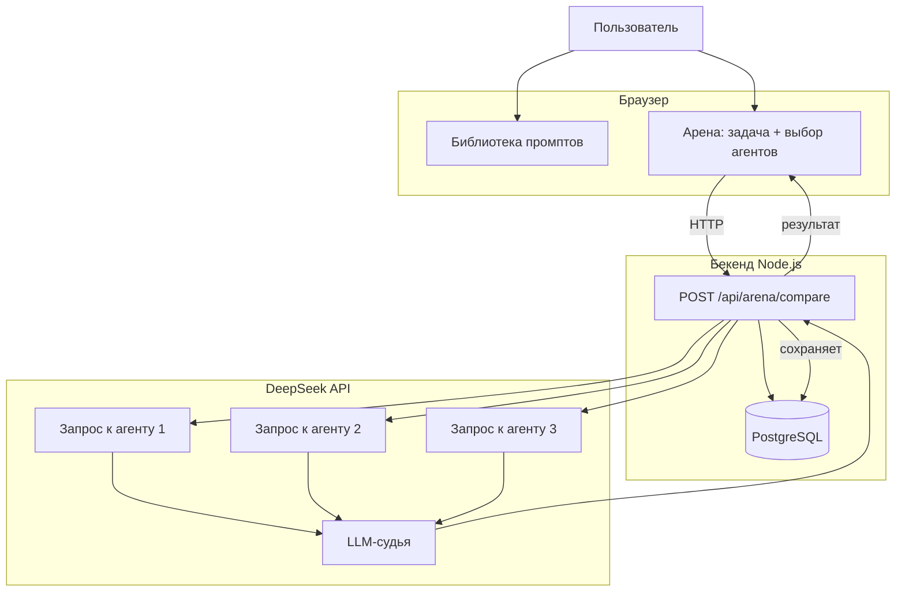

# ⚡ PromptArena

**Библиотека промптов + Арена для сравнения агентов через DeepSeek API**

[](https://opensource.org/licenses/MIT)
[](https://github.com/yourusername/promptarena)

---

## 📖 О проекте

**PromptArena** — это платформа, которая позволяет:

- 📚 **Хранить и делиться промптами** в структурированной библиотеке
- ⚔️ **Сравнивать агентов** (промпты) на одной задаче через единый LLM API
- 📊 **Оценивать** по точности, скорости, цене и **количеству токенов**
- 🏆 **Выявлять лучшего агента** для конкретной задачи

### Чем отличается от других

| Другие платформы | PromptArena |
| :--- | :--- |
| Голосование сообщества | **Объективные метрики** (точность, скорость, токены) |
| Ручное тестирование | **Автоматизированное сравнение** через LLM |
| Нет данных о токенах | **Полная статистика** по токенам на вход/выход |
| Социальная сеть | **Инструмент для инженерии промптов** |

---

## 🧩 Архитектура


---

## 🛠️ Технологии

| Компонент | Технология |
| :--- | :--- |
| **Фронтенд** | HTML5 + CSS3 + Vanilla JS |
| **Бекенд** | Node.js + Express |
| **LLM** | DeepSeek API (Flash / Pro) |
| **База данных** | PostgreSQL (Supabase / локально) |
| **Хостинг** | Vercel (фронт) + Render / Heroku (бекенд) |

---

## 🚀 Быстрый старт
1. Клонируй репозиторий
```bash
git clone https://github.com/TuttaLarsen/promptarena.git
cd promptarena
```
2. Установи зависимости
Что это: Устанавливает все внешние библиотеки, которые нужны проекту.

Если у тебя есть package.json (лежит в папке проекта):
```
npm install
```
Если package.json нет (ты создаёшь проект с нуля):
```
npm init -y
npm install express cors dotenv pg
```
Что установится:
| Пакет | Для чего |
| :--- | :--- |
| **express** | Бекенд-фреймворк (сервер) |
| **cors** | Разрешает запросы с фронтенда |
| **dotenv** | Загружает секреты и настройки из `.env` |
| **pg** | Драйвер для подключения к PostgreSQL |

Для разработки (автоперезапуск):
```
npm install --save-dev nodemon
```
Что должно получиться:

Появится папка node_modules — это все скачанные библиотеки

Появится файл package-lock.json — фиксирует точные версии пакетов

Без этого шага: Проект не запустится, будет ошибка Error: Cannot find module 'express'.

3. Настрой переменные окружения
Что это: Создаёт файл, где хранятся секретные данные (API-ключи). Он не пушится в репозиторий, чтобы ключи не украли.

Как сделать:

Создай в корне проекта файл .env:
```
DEEPSEEK_API_KEY=sk-твой_ключ_от_deepseek
PORT=3001
```
Где выполнять: В корневой папке проекта создать файл .env и вставить туда эти две строки.

Откуда взять ключ: Зарегистрируйся на platform.deepseek.com, создай API-ключ и вставь его вместо sk-твой_ключ_от_deepseek.

Что должно получиться: В папке проекта появится файл .env с ключом внутри.

Без этого шага: Запросы к DeepSeek API будут падать с ошибкой авторизации.

4. Запусти проект
Что это: Запускает сервер, и ты можешь открыть сайт в браузере.
```
npm start
```

Где выполнять: В терминале, внутри папки promptarena.

Что должно получиться: В терминале появится надпись:
```
✅ Сервер запущен на http://localhost:3001
```
Открой браузер и перейди по адресу http://localhost:3001.

---
## 📂 Структура проекта
```text
promptarena/
├── public/
│   └── index.html      # Фронтенд (интерфейс приложения)
├── .env                # Переменные окружения и секреты
├── .gitignore          # Исключения для Git (node_modules, .env)
├── package.json        # Зависимости и скрипты проекта
├── README.md           # Документация проекта
└── server.js           # Бекенд (сервер на Express.js)
```
---

## 🧪 API Эндпоинты

### 1. Получить все промпты из библиотеки
* **URL:** `/api/prompts`
* **Метод:** `GET`
* **Описание:** Возвращает список всех доступных промптов.

#### Ответ (`200 OK`):
```json
[
  {
    "id": 1,
    "name": "Автотест для API-логина",
    "category": "QA",
    "description": "Генерирует автотест на PyTest",
    "body": "Ты — эксперт по автоматизации...",
    "is_agent": false,
    "rating": 4.9,
    "likes": 24
  }
]
```

---

### 2. Сравнить выбранных агентов (Арена)
* **URL:** `/api/arena/compare`
* **Метод:** `POST`
* **Описание:** Отправляет задачу на сравнение нескольким агентам одновременно.

#### Тело запроса (`application/json`):
```json
{
  "task": "Напиши автотест для входа",
  "agent_ids": [1, 3, 5]
}
```

#### Ответ (`200 OK`):
```json
{
  "task": "Напиши автотест...",
  "results": [
    {
      "agent_id": 1,
      "name": "CodeGen Pro",
      "accuracy": 9.2,
      "speed": 0.8,
      "price": 0.001,
      "prompt_tokens": 1245,
      "completion_tokens": 389,
      "total_tokens": 1634,
      "answer": "..."
    }
  ],
  "winner_id": 1
}
```
---

## 🗄️ База данных (Supabase)

### Структура таблицы `prompts`

Для создания таблицы в Supabase выполните следующий SQL-запрос в разделе **SQL Editor**:

```sql
CREATE TABLE prompts (
  id SERIAL PRIMARY KEY,                  -- Уникальный идентификатор
  name VARCHAR(255) NOT NULL,             -- Название промпта
  category VARCHAR(50) NOT NULL,          -- Категория (например, QA, Разработка)
  description TEXT,                       -- Краткое описание
  body TEXT NOT NULL,                     -- Сам текст промпта
  is_agent BOOLEAN DEFAULT false,         -- Является ли агентом
  rating DECIMAL(3,2) DEFAULT 0.00,       -- Рейтинг (от 0 до 5)
  likes INTEGER DEFAULT 0,                -- Количество лайков
  author VARCHAR(100),                    -- Автор промпта
  tags TEXT[],                            -- Массив тегов (например, ['pytest', 'python'])
  created_at TIMESTAMP DEFAULT NOW()      -- Дата и время создания
);
```

### Структура таблицы `comparisons`

Эта таблица используется для сохранения истории сравнений и результатов работы агентов на Арене.

```sql
CREATE TABLE comparisons (
  id SERIAL PRIMARY KEY,                  -- Уникальный идентификатор сессии сравнения
  task TEXT NOT NULL,                     -- Текст отправленной задачи (промпта)
  results JSONB NOT NULL,                 -- Массив результатов сравнения агентов в формате JSONB
  created_at TIMESTAMP DEFAULT NOW()      -- Дата и время проведения сравнения
);
```
---

## 🧠 Как это работает
Пользователь выбирает 2-3 агента в арене

Вводит задачу

Бекенд отправляет запросы в DeepSeek API

Получает ответы и статистику по токенам

LLM-судья оценивает точность

Результат сохраняется в БД и отображается на UI

---

## 🎯 Дорожная карта

UI (библиотека + арена)

Имитация сравнения с токенами

Реальный API DeepSeek

PostgreSQL (Supabase)

Аутентификация пользователей

История сравнений

Экспорт результатов (PDF/CSV)
