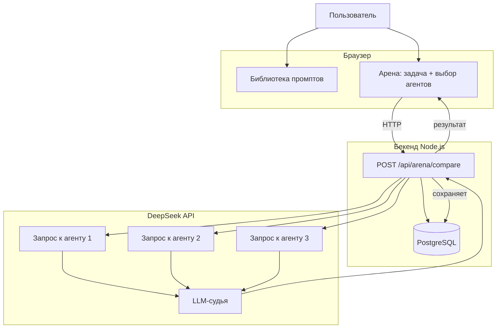

# ⚡ PromptArena

**Библиотека промптов + Арена для сравнения агентов через DeepSeek API**

[](https://opensource.org/licenses/MIT)
[](https://github.com/yourusername/promptarena)

---

## 📖 О проекте

**PromptArena** — это платформа, которая позволяет:

- 📚 **Хранить и делиться промптами** в структурированной библиотеке
- ⚔️ **Сравнивать агентов** (промпты) на одной задаче через единый LLM API
- 📊 **Оценивать** по точности, скорости, цене и **количеству токенов**
- 🏆 **Выявлять лучшего агента** для конкретной задачи

### Чем отличается от других

| Другие платформы | PromptArena |
| :--- | :--- |
| Голосование сообщества | **Объективные метрики** (точность, скорость, токены) |
| Ручное тестирование | **Автоматизированное сравнение** через LLM |
| Нет данных о токенах | **Полная статистика** по токенам на вход/выход |
| Социальная сеть | **Инструмент для инженерии промптов** |

---

## 🧩 Архитектура


---

## 🛠️ Технологии

| Компонент | Технология |
| :--- | :--- |
| **Фронтенд** | HTML5 + CSS3 + Vanilla JS |
| **Бекенд** | Node.js + Express |
| **LLM** | DeepSeek API (Flash / Pro) |
| **База данных** | PostgreSQL (Supabase / локально) |
| **Хостинг** | Vercel (фронт) + Render / Heroku (бекенд) |

---

## 🚀 Быстрый старт

### 1. Клонируй репозиторий

```bash
git clone https://github.com/yourusername/promptarena.git
cd promptarena
2. Установи зависимости
bash
npm install
3. Настрой переменные окружения
Создай файл .env в корне проекта:

env
DEEPSEEK_API_KEY=sk-твой_ключ_от_deepseek
DATABASE_URL=postgresql://... (если используешь БД)
PORT=3001
4. Запусти локально
bash
npm run dev
Открой http://localhost:3001 — готово!

📂 Структура проекта
text
promptarena/
├── public/
│   └── index.html          # Фронтенд (UI)
├── server.js               # Бекенд API
├── package.json            # Зависимости и скрипты
├── .env                    # Переменные окружения (не коммитить!)
├── .gitignore              # Что не отправлять в репозиторий
└── README.md               # Ты здесь
🧪 API Эндпоинты
GET /api/prompts
Получить все промпты (библиотека)

Ответ:

json
[
  {
    "id": 1,
    "name": "Автотест для API-логина",
    "category": "QA",
    "description": "...",
    "body": "...",
    "is_agent": false,
    "rating": 4.9,
    "likes": 24
  }
]
POST /api/arena/compare
Сравнить выбранных агентов

Тело запроса:

json
{
  "task": "Напиши автотест для входа",
  "agent_ids": [1, 3, 5]
}
Ответ:

json
{
  "task": "Напиши автотест...",
  "results": [
    {
      "agent_id": 1,
      "name": "CodeGen Pro",
      "accuracy": 9.2,
      "speed": 0.8,
      "price": 0.001,
      "prompt_tokens": 1245,
      "completion_tokens": 389,
      "total_tokens": 1634,
      "answer": "..."
    }
  ],
  "winner_id": 1
}
🎯 Дорожная карта (Roadmap)
UI (библиотека + арена)

Имитация сравнения с токенами

Реальный API DeepSeek

PostgreSQL (Supabase)

Аутентификация пользователей

История сравнений

Экспорт результатов (PDF/CSV)

Платные тарифы (для бизнеса)

